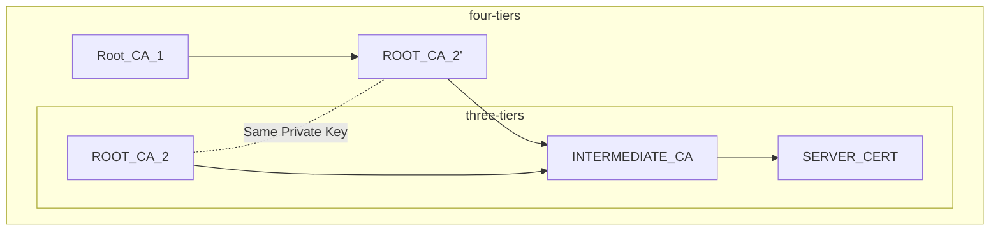

# How to create Cross Root Certificate with CRL endpoint



## Requirements

- openssl 3.0.x
- PowerShell 5.x or 7.x
- Web server that stores the CRL (I use Azure Blob with Force Encryption set to False)

## Helper function

```powershell
switch ($PSEdition) {
    "Desktop" { 
        Function Out-FileWithUTF8 {
            param(
                [Parameter(Mandatory=$true,ValueFromPipeline=$true)]
                [string]$Content,
                [Parameter(Mandatory=$true)]
                [string]$Path
            )
            $Content | %{[Text.Encoding]::UTF8.GetBytes($_)} | Set-Content -Encoding Byte -Path $Path
        }
     }
    "Core" {
        Function Out-FileWithUTF8 {
            param(
                [Parameter(Mandatory=$true,ValueFromPipeline=$true)]
                [string]$Content,
                [Parameter(Mandatory=$true)]
                [string]$Path
            )
            $Content | Out-File -Encoding utf8 -FilePath $Path -NoNewline
        }
    }
}
```

## Create Folders

```powershell
$configPath = Join-Path -Path $(Get-Location) -ChildPath openssl.cnf
$env:OPENSSL_CONF = $configPath

$ENV:ALT_NAME = "altname.example.com"
$CRL_FOR_ROOT_CA_1 = "http://your-host/root_ca_1.crl"
$CRL_FOR_ROOT_CA_2 = "http://your-host/root_ca_2.crl"
```

```powershell
$CaList = "root_ca_1","root_ca_2","intermediate_ca"
$CaList | %{ New-Item -Type Directory "$_\ca" }
```

```sh
$CaList | %{
    cd "$_\ca"
    New-Item -Type Directory "certs", "crl","newcerts","private"
    "0001" | Out-String | Out-FileWithUTF8 -Path serial
    New-Item -Type File -Path index.txt
    "0001" | Out-String | Out-FileWithUTF8 -Path crlnumber
    cd ../../
}
```

## Create Root CAs

```sh
openssl genrsa -out ./root_ca_1/ca/private/ca.key.pem 2048
openssl req -reqexts v3_req -new -key ./root_ca_1/ca/private/ca.key.pem -x509 -nodes -days 3650 -out ./root_ca_1/ca/certs/ca.crt.pem -subj "/C=JP/ST=Tokyo/L=Shinagawa/O=Contoso/OU=CA/CN=ROOT_CA_1"

openssl genrsa -out ./root_ca_2/ca/private/ca.key.pem 2048
openssl req -reqexts v3_req -new -key ./root_ca_2/ca/private/ca.key.pem -x509 -nodes -days 3650 -out ./root_ca_2/ca/certs/self.ca.crt.pem -subj "/C=JP/ST=Tokyo/L=Shinagawa/O=Contoso/OU=CA/CN=ROOT_CA_2"
```

## Sign ROOT_CA_2 with ROOT_CA_1 (Cross root)

```sh
openssl req -new -key ./root_ca_2/ca/private/ca.key.pem -out ./root_ca_2/ca/certs/cert.req -subj "/C=JP/ST=Tokyo/L=Shinagawa/O=Contoso/OU=CA/CN=ROOT_CA_2"
```

Signed with ROOT_CA_1

```sh
$env:CRL_URL=$CRL_FOR_ROOT_CA_1
cd root_ca_1
openssl ca  -extensions v3_ca_with_crl -in ../root_ca_2/ca/certs/cert.req -days 3650 -out ../root_ca_2/ca/certs/ca.crt.pem
cd ..
```

```conf
[ v3_ca_with_crl ]

# Extensions to add to a certificate request

basicConstraints = CA:TRUE
keyUsage = critical, cRLSign, keyCertSign

crlDistributionPoints = URI:$ENV::CRL_URL

# PKIX recommendations harmless if included in all certificates.
subjectKeyIdentifier=hash
authorityKeyIdentifier=keyid,issuer
```

Then ROOT_CA_1 ca behave as Intermediate CA.

## Create Intermediate CA

```powershell
openssl genrsa -out ./intermediate_ca/ca/private/ca.key.pem 2048
openssl req -new -key ./intermediate_ca/ca/private/ca.key.pem -out ./intermediate_ca/ca/certs/cert.req -subj "/C=JP/ST=Tokyo/L=Shinagawa/O=Contoso/OU=CA/CN=INTERMEDIATE_CA"
```

Signed with ROOT_CA_2

```sh
$env:CRL_URL=$CRL_FOR_ROOT_CA_2
cd root_ca_2
openssl ca -extensions v3_ca_with_crl -in ../intermediate_ca/ca/certs/cert.req -days 3650 -out ../intermediate_ca/ca/certs/ca.crt.pem
cd ../
```

## Create Server Certificate

```conf
[ v3_server_req ]
basicConstraints=CA:FALSE
keyUsage = digitalSignature, keyEncipherment
extendedKeyUsage = serverAuth

subjectAltName = @alt_names

# CRL is not needed in my environment
# crlDistributionPoints = URI:$ENV::CRL_URL

[ alt_names ]
DNS.1 = $ENV::ALT_NAME
```

```powershell
cd intermediate_ca
openssl genrsa -out ./server.key 2048
openssl req  -new -extensions v3_server_req -key ./server.key -out server.csr -subj "/C=JP/ST=Tokyo/L=Shinagawa/O=Contoso/OU=CA/CN=$($env:ALT_NAME)"
openssl ca -extensions  v3_server_req -in ./server.csr -days 365 -out ./server.cer
cd ..
```

## Create PFX

```powershell
New-Item -Type Directory "output"

$ServerCert = Get-Content .\intermediate_ca\server.cer
$IntermediateCert = Get-Content .\intermediate_ca\ca\certs\ca.crt.pem
$RootCA2CertSignedByRootCA1 = Get-Content .\root_ca_2\ca\certs\ca.crt.pem
$RootCA1Cert = Get-Content .\root_ca_1\ca\certs\ca.crt.pem
$CertChain = $ServerCert + $IntermediateCert + $RootCA2CertSignedByRootCA1 + $RootCA1Cert
$CertChain | Out-String | Out-FileWithUTF8 -Path ./output/certchain.cer

$RootCA1Cert | Out-String | Out-FileWithUTF8 -Path./output/ROOT_CA_1.cer
$RootCA2Cert = Get-Content .\root_ca_2\ca\certs\self.ca.crt.pem
$RootCA2Cert | Out-String | Out-FileWithUTF8 -Path ./output/ROOT_CA_2.cer
$RootCA2CertSignedByRootCA1 | Out-String | Out-FileWithUTF8 -Path ./output/ROOT_CA_2_singed_by_CA1.cer

openssl pkcs12 -export -certpbe PBE-SHA1-3DES -keypbe PBE-SHA1-3DES -nomac -out ./server.pfx  -inkey ./intermediate_ca/server.key -in ./certchain.cer -nodes
```

Certificates and pxf are saved in output folder.

- ROOT_CA_1.cer: self-signed root ca 1 certificate
- ROOT_CA_2.cer: self-signed root ca 2 certificate
- ROOT_CA_2_singed_by_CA1.cer: root ca 2 certificate signed by ca 1
- certchaing.cer: Full chain certificates (ROOT_CA_1 -> ROOT_CA_2 -> INTERMEDIATE_CA -> SERVER_CERT)
- server.pfx: Server certificate include private key and full chain certificates

## Revoke Intermediate Certificate

```sh
# revoke root ca 2
cd root_ca_1
openssl ca -revoke .\ca\newcerts\01.pem
openssl ca  -gencrl -crldays 1 -out ../output/crossrootlab_root_ca_1.crl
cd ..

cd root_ca_2
openssl ca -gencrl -crldays 1 -out ../output/crossrootlab_root_ca_2.crl
cd ..
```

upload crls

```powershell
# example using Azure Blob
azcopy copy ./output/crossrootlab_root_ca_1.crl ""
```